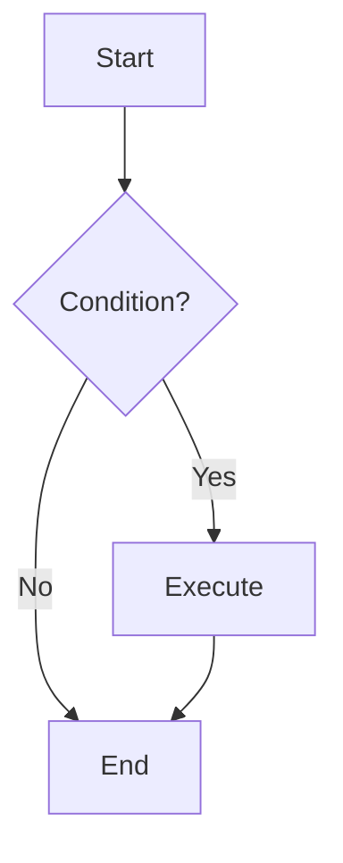
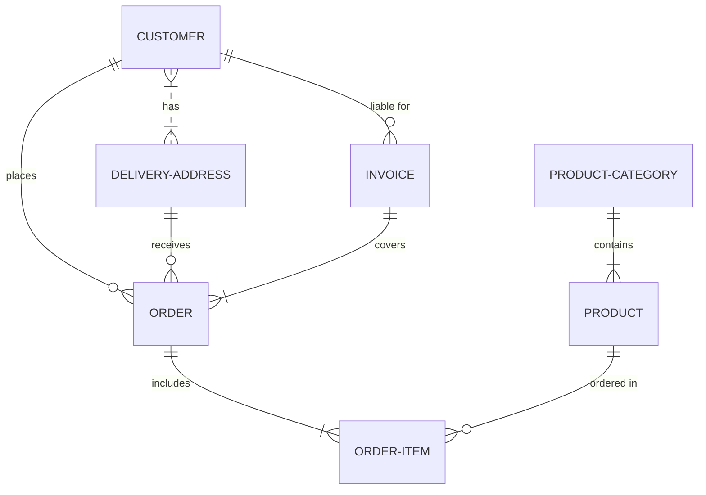
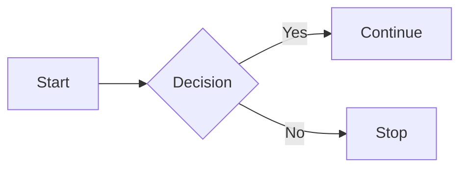

# Mermaid

Mermaid is a library designed to create powerful vizualizations with low efforts, with the mermaid syntax you can create database diagrams, control flow graphs and everything you want.. Learn more about [Mermaid syntax](https://mermaid.ai/open-source/intro/syntax-reference.html)

## Examples

````text title="Mermaid Example"

````

> ```mermaid
> flowchart TD
>     A[Start] --> B{Condition?}
>     B -->|Yes| C[Execute]
>     B -->|No| D[End]
>     C --> D
> ```

---

````text title="Mermaid Example"

````

> ```mermaid
> erDiagram
>           CUSTOMER }|..|{ DELIVERY-ADDRESS : has
>           CUSTOMER ||--o{ ORDER : places
>           CUSTOMER ||--o{ INVOICE : "liable for"
>           DELIVERY-ADDRESS ||--o{ ORDER : receives
>           INVOICE ||--|{ ORDER : covers
>           ORDER ||--|{ ORDER-ITEM : includes
>           PRODUCT-CATEGORY ||--|{ PRODUCT : contains
>           PRODUCT ||--o{ ORDER-ITEM : "ordered in"
> ```

---

````text title="Mermaid Example"

````

> ```mermaid
> flowchart LR
>   A[Start] --> B{Decision}
>   B -->|Yes| C[Continue]
>   B -->|No| D[Stop]
> ```

You can find more examples and diagram builders online. _Use diagrams only when needed.._
